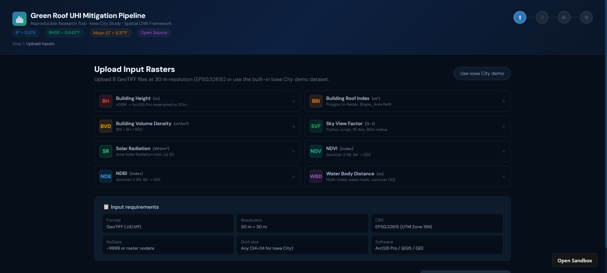
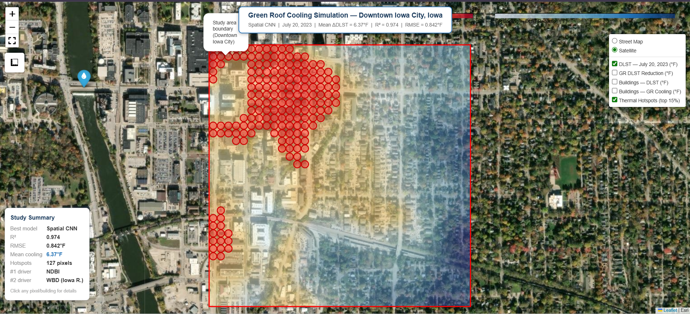
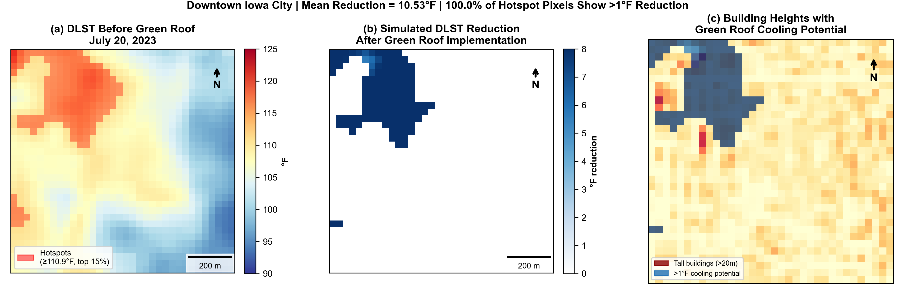

# Urban Heat Island Mitigation Using Deep Learning, LiDAR, and Satellite Remote Sensing  
### Spatial CNN-Based Green Roof Cooling Assessment in Downtown Iowa City

<p align="center">

[](https://w75frp.csb.app/)
[](https://mirza9003.github.io/green-roof-iowa-city-cnn/)
[](LICENSE)
[]()

</p>

---

# Live Interactive Research Platform

This repository provides a **fully reproducible GeoAI framework** integrating:

- Deep Learning  
- LiDAR  
- Satellite Remote Sensing  
- Urban Morphology  
- Spatial CNN  

to simulate **green roof cooling potential** in **Downtown Iowa City, Iowa**.

---

# Interactive Web Application

🌐 **Live Web Application**  
https://w75frp.csb.app/

<p align="center">
  
</p>

<p align="center">
<em>Interactive Spatial CNN web application for green roof cooling simulation, model evaluation, and hotspot visualization.</em>
</p>

The interactive dashboard allows users to:

- Visualize Urban Heat Island mitigation  
- Explore Spatial CNN predictions  
- View cooling distribution maps  
- Analyze thermal hotspots  
- Inspect model performance  
- Reproduce simulation results  

---

# Interactive Web Map

🗺️ **Interactive Web Map**  
https://mirza9003.github.io/green-roof-iowa-city-cnn/

<p align="center">
  
</p>

<p align="center">
<em>Interactive building-level cooling map showing DLST distribution, thermal hotspots, and predicted green roof cooling potential.</em>
</p>

Features:

- Satellite basemap  
- DLST visualization  
- Thermal hotspot detection  
- Green roof cooling simulation  
- Layer toggling  
- Building-level inspection  

---

# Simulation Results

<p align="center">
  
</p>

<p align="center">
<em>Spatial CNN based simulated daytime land surface temperature reduction under green roof implementation in Downtown Iowa City, Iowa.</em>
</p>

---

# Overview

This repository contains the reproducible codebase for a **green roof urban heat island mitigation study** in **Downtown Iowa City, Iowa**. The workflow integrates:

- LiDAR derived urban morphology  
- Satellite remote sensing  
- Deep learning models  
- Spatial CNN architecture  

to predict **daytime land surface temperature (DLST)** and simulate **green roof cooling potential**.

---

# Study Title

**Climate-Resilient Urban Cooling Using LiDAR-Derived Urban Morphology and Spatial Deep Learning: A GeoAI Framework for Green Roof Assessment in Downtown Iowa City, Iowa**

---

# Author

**Mirza Md Tasnim Mukarram**  
PhD Researcher | GeoAI | Climate Resilience  
University of Iowa  
2026

---

# Key Results

| Metric | Value |
|--------|-------|
| Best model | Spatial CNN |
| Test R² | 0.974 |
| RMSE | 0.842 °F |
| K-Fold R² | 0.962 ± 0.007 |
| Mean green roof cooling | 6.37 °F |
| Maximum green roof cooling | 10.27 °F |
| Hotspot coverage | 100% pixels > 1 °F |

---

# Models Evaluated

The modelling framework evaluated six predictive models:

- Artificial Neural Network (ANN)  
- Random Forest  
- XGBoost  
- Spatial CNN  
- CNN-LSTM  
- Vision Transformer  

Among them, **Spatial CNN achieved the best predictive performance**.

---

# Input Variables

## LiDAR Derived Variables

- Building Height (BH)  
- Building Volume Density (BVD)  
- Sky View Factor (SVF)  
- Surface Roughness (SR)  
- Building Roof Index (BRI)  

## Satellite Variables

- NDVI  
- NDBI  
- Water Body Distance (WBD)  

---

# Methodology Workflow

## Data Processing

1. LiDAR point cloud processing  
2. DSM and DTM generation  
3. Height normalization (HAG)  
4. Building footprint extraction  

## Remote Sensing Processing

5. Sentinel 2 preprocessing  
6. NDVI and NDBI computation  
7. Water body distance calculation  

## GeoAI Modeling

8. Feature engineering  
9. Training dataset creation  
10. Model benchmarking  
11. Spatial CNN optimization  

## Simulation

12. DLST prediction  
13. Green roof scenario modeling  
14. Cooling potential mapping  

## Visualization

15. Interactive dashboard  
16. Web GIS mapping  
17. Research visualization outputs  

---

# Repository Structure

```text
├── ModelCode.py
├── GreenRoof_Pipeline.jsx
├── GreenRoof_Interactive_Map_v2.html
├── GR_Simulation_Maps.png
├── Model_App.png
├── InteractiveWebMap_IA.png
├── Fig10_GR_Simulation_Maps.png
├── README.md
├── LICENSE
