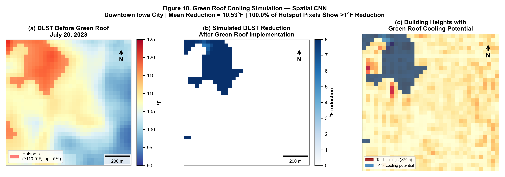

# Urban Heat Island Mitigation Using Deep Learning, LiDAR, and Satellite Remote Sensing
### Spatial CNN-based Green Roof Cooling Assessment in Downtown Iowa City

<p align="center">
  
</p>

<p align="center">
  <em>Figure: Simulated daytime land surface temperature reduction under green roof implementation in Downtown Iowa City, Iowa.</em>
</p>

---

## Overview

This repository contains the reproducible codebase for a green roof urban heat island mitigation study in Downtown Iowa City, Iowa. The workflow integrates LiDAR-derived urban morphological variables, satellite remote sensing products, and machine learning/deep learning models to predict daytime land surface temperature (DLST) and simulate the cooling potential of green roof implementation.

The modelling framework evaluates six predictive models:

- ANN  
- Random Forest  
- XGBoost  
- Spatial CNN  
- CNN-LSTM  
- Vision Transformer  

Among them, the **Spatial CNN** achieved the best overall predictive performance. :contentReference[oaicite:1]{index=1}

**Study title:**  
*Exploring the Cooling Potential of Green Roofs for Mitigating Urban Heat Islands Using LiDAR, Satellite Remote Sensing, and Spatial Convolutional Neural Networks: A Case Study of Downtown Iowa City, Iowa*

**Author:**  
*Mirza Md Tasnim Mukarram, University of Iowa (2026)*

---

## Key Results

| Metric | Value |
|--------|-------|
| Best model | Spatial CNN |
| Test R² | 0.974 |
| RMSE | 0.842 °F |
| K-Fold R² | 0.962 ± 0.007 |
| Mean green-roof cooling | 6.37 °F |
| Maximum green-roof cooling | 10.27 °F |
| Hotspot coverage | 100% of hotspot pixels showed >1 °F reduction |

---

## Repository Structure

```text
├── ModelCode.py                    # Main modelling and figure-generation pipeline
├── GreenRoof_Pipeline.jsx          # Interactive reproducibility app
├── GreenRoof_Interactive_Map.html  # Interactive web map
├── Fig10_GR_Simulation_Maps.png    # Main simulation figure used in README
├── README.md
